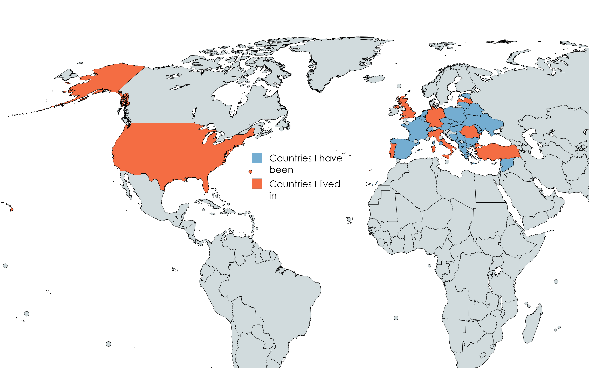

## 🚀 About Me

> "Engineering is all about perspective, and traveling is such a builder for it."

I'm a Machine Learning Engineer with a passion for solving complex problems through AI and computer vision. With over 3 years of experience, I specialize in designing and implementing machine learning models for real-world applications.

- 🔭 Currently working as a **Machine Learning Engineer**
- 🌱 Focusing on **RAG Systems**, **LLMs**, and **Computer Vision**
- 🌍 Lived in **7 countries**, visited **30+** nations
- 📚 Language enthusiast with a  day streak!
- 🥚 Co-author of the paper ["High accuracy gender determination using the egg shape index"](https://www.nature.com/articles/) in Nature - Scientific Reports

### 🗺️ Travel & Living Map

## 📫 Connect With Me

