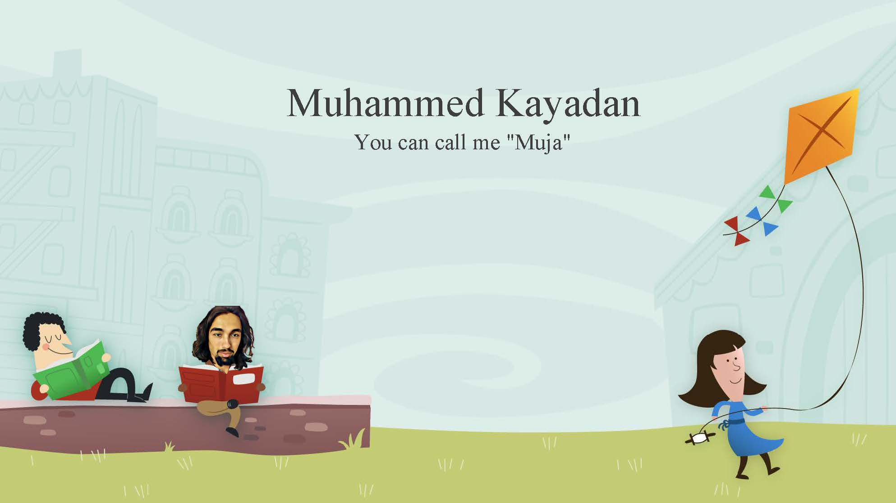

<!-- Visitor badge is done with visitorbadge.io -->

## :book: 𝙰𝚋𝚘𝚞𝚝 𝙼𝚎
- **Career Goals:** My overarching career goal is to make meaningful contributions to the field, leveraging my skills to solve complex problems and create impactful solutions.  

- **Career Summary:** A passionate Software Engineer with over 2 years of experience implementing highly scalable robust industrial computer vision applications using machine learning algorithms. Proficient in algorithm development, research & development processes, and finding suitable solutions for complex industrial needs. Hands-on using Python, Matlab, C++ OpenCV, and Deep Learning libraries.  

- **Core Competences:** Object-Oriented Programming, Deep Learning, Computer Vision, Image Processing, Machine Learning, Signal Processing, Algorithm Design, Problem-Solving  

- Obsessed with chickens, and I am working on eggs, co-author of the "High accuracy gender determination using the egg shape index" paper.  

- For me, engineering is all about perspective and traveling is such a "builder" for it.      

<!-- This badge is updated from duolingo_streak_updater.py and Github actions. -->
- A language enthusiast. I have lived in 7 countries, been to more than 30 countries.   

## Contact
  

